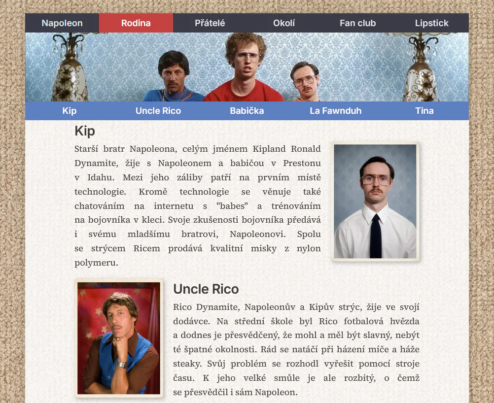

# Napoleon Dynamite – legenda z Prestonu v Idaho

Školní projekt vytvořený pro procvičení HTML a CSS.

## Veřejná adresa webu

Web je dostupný zde:

https://mak-024.github.io/webovka01/

Repozitář dostupný na https://github.com/mak-024/webovka01

## Téma webu

Tématem webové prezentace je svět kolem Napoleona Dynamita, jeho rodiny, přátel, okolí, fan clubu a fiktivního obchodu s relikviemi.

## Náhled stránky

## Navigační menu

Navigační menu byla vytvořena dvě, `<nav class="main-nav">` a `<nav class="sec-nav">` v patičce `<header>`.

### Hlavní navigační menu

Hlavní navigační menu je vytvořeno jako lišta a funguje jako odkazy mezi jednotlivými `*.html` soubory. Menu je vytvořeno pomocí nečíslovaných seznamů `<ul>` a položek `<li>`. V CSS byl změněm způsob řazení pomocí vlastnosti `display: flex;`.

### Podnabídka

Podnabídka byla vytvořena stejně, jako hlavní nabídka, pomocí nečíslovaných seznamů `<ul>` a položek `<li>`. V CSS byl opět změněm způsob řazení pomocí vlastnosti `display: flex;`. Odkazy tentokrát odkazují na jednotlivé články `<article>` s identifikátorem, tedy např. `<article id="section1">`.

## Bannery

Pro bannery byl zvolen formát obrázků `*.webp`. Velikost souborů se tak pohybuje mezi 31-73 kB.

## Struktura webu

Web je podle zadání rozdělen na několik HTML souborů:

| soubor HTML | téma |
| :--- | :--- |
| `index.html` | - úvodní stránka |
| `family.html` | - rodina |
| `friends.html` | - přátelé |
| `other.html` | - okolí |
| `fan-club.html` | - fan club |
| `lipstick.html` | - fiktivní obchod |
| `thanks.html` | - poděkování po odeslání formuláře |

## Favicon ve 3 velikostech

Pro favicon byl zvolen formát souboru `*.png`. Jelikož jde o malé obrázky, velikost souborů není větší, než pár kB. Obrázek jsem vystřihl ze studenstké průkazky Napoleona, která je vidět pouze na začátku filmu. Počáteční písmena tam byla nejzřetelnější a na tak malém formátu stále pěkně čitelná. Na úpravu obrázků jsem používal GIMP.

## Externí odkaz

Externí odkaz je vložen do patičky `<footer>` a odkazuje na vedlější repozitář, kde je opět web o Napoleonovi Dynamitovi, jen opravený a mírně vylepšený pomocí Antigravty.

## Formuláře

Formuláře jsem použil v pseudo shopu s relikviemi na stránce "lipstick". Použity byli značky (tagy) `<input type="number" min="0" max="99">` pro vkládání množství objednávaného materiálu. Pro vytvoření iluze objednávky jsem použil `<label for="name">Jméno, příjmení:</label>` a `<input type="text" id="name" required>` pro vkládání jména a také emailové adresy pro dořešení objednávky. Po stisku tlačítka  `<button type="submit">` se otevře malá stránka čistě jen na "potvrzení" objednávky.

## Splnění zadání

Webová prezentace obsahuje:

- několik HTML souborů,
- hlavičku a patičku,
- nadpisy, odstavce a seznamy,
- hlavní navigační menu,
- odkazy do části vlastního dokumentu,
- odkazy na jiné HTML dokumenty prezentace,
- externí odkaz je na webovku02,
- obrázky,
- tabulku,
- formulář se vstupními políčky různého typu.

Dále byly upraveny mezery za spojkami a předložkami ve větách, aby nedocházelo k nevhodnému zalamování věty.

## Použité technologie

- HTML5
- CSS
- GitHub Pages

## Optimalizace, SEO a přístupnost

Při tvorbě webu byly použity sémantické HTML prvky jako `<header>`, `<nav<`, `<main>`, `<article>`, `<section>` a `<footer>`.

Obrázky obsahují atribut `alt`. Formulářová pole jsou propojena s popisky pomocí prvku `label`. Web používá vlastní CSS styly, proměnné, responzivnější práci s obrázky a optimalizované obrázky ve formátu WebP.

## Autor

Martin Kriššák, V2I
